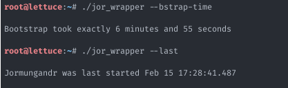
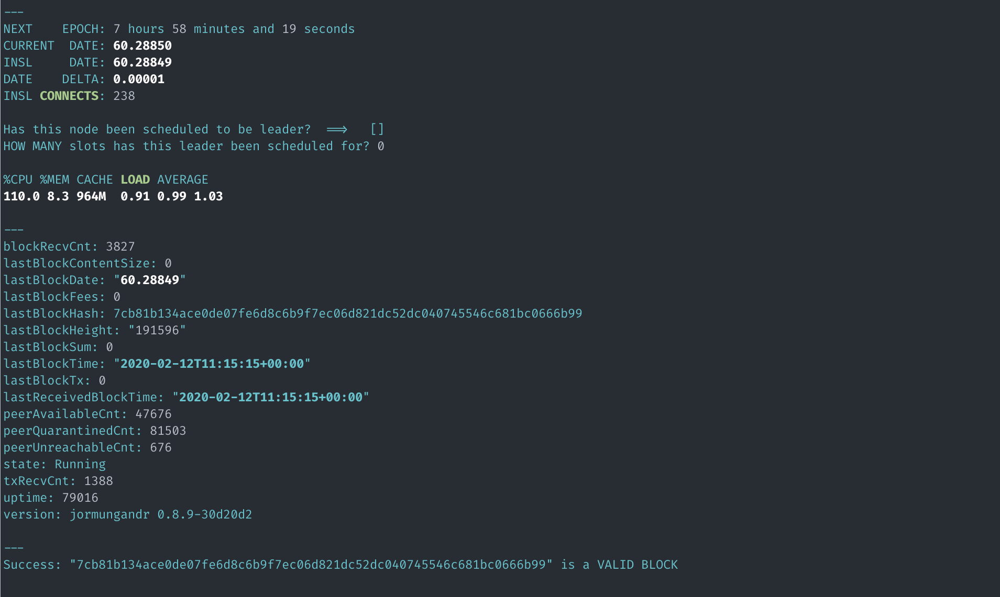

# Pool Operator Helper Scripts #

## About ##

Here you find some notes for ```jor_wrapper``` and ```node_helpers```; a set of ```bash``` scripts to help pool operators manage their nodes. These spun scripts are to be used with the ```NACG``` guide setup. You can [**find it here**](https://guides.insalada.io/#/NACG).

### Contribution ###

If you have suggestions on how to improve these scripts, or would like to see more documentation about ```jor_wrapper```, or yet more example system administration commands, please [file an issue](https://github.com/gacallea/cardanoRelatedStuff/issues) on Github. Constructive feedback is always at home here.

### License ###

Both ```jor_wrapper``` and the ```node_helpers``` scripts are licensed under the terms of the [GPLv3](scripts/LICENSE) license.

## jor_wrapper ##

. ```jor_wrapper``` is a script with a number of useful commands for pool operators. It has all sort of checks, stats, and more commands, to help you manage your node. I will assume that you have placed ```jor_wrapper```, ```jor_config```, and ```jor_funcs```, in your ```/root``` directory like explained earlier; and that you have setup your pool as explained in [my guide](https://guides.insalada.io/#/NACG).

**Before you go any further**, though, make sure you set your own variables in ```jor_config``` first:

```text
RECEIVER_ACCOUNT="<YOUR_POOL_PLEDGE_ADDRESS>"
POOL_TICKER="<YOUR_POOL_TICKER>"
JORMUNGANDR_USERNAME="<YOUR_POOL_USER>"
JORMUNGANDR_FILES="/home/${JORMUNGANDR_USERNAME}"
JORMUNGANDR_CONFIG="${JORMUNGANDR_FILES}/node-config.yaml"
JORMUNGANDR_SECRET="${JORMUNGANDR_FILES}/node-secret.yaml"
JORMUNGANDR_STORAGE_DIR="${JORMUNGANDR_FILES}/storage"
JORMUNGANDR_STORAGE_FILE="${JORMUNGANDR_STORAGE_DIR}/blocks.sqlite"
JORMUNGANDR_PUBLIC_IP_ADDR="<YOUR_NODE_PUBLIC_IP>"
JORMUNGANDR_RESTAPI_PORT="<REST_API_PORT>"
JORMUNGANDR_RESTAPI_URL="http://127.0.0.1:${JORMUNGANDR_RESTAPI_PORT}/api"
```

Once you have configured the above variables to match your system, run the following to set them into ```/root/.bashrc```

```text
./jor_wrapper --set-vars
```

### Quick Examples ###

#### logs ####

As an example of what ```jor_wrapper``` can help you with, is that you can check the pool logs in four different ways:

- ```--live-logs```: it will show live logs scrolling on your terminal
- ```--last-logs```: it will dump the last #N lines of logs on your terminal
- ```--problems```: it will search for serious problems (```cannot|stuck|exit|unavailable```) for the last #N lines of logs
- ```--issues```: it will search for issues (```WARN|ERRO```) for the last #N lines of logs

#### stats ####

Another quick example is about stats:

- ```--node-stats```: it will show the pool ```node stats get``` from the ```jcli``` REST API
- ```--pool-stats```: it will show the pool ```stake-pool get``` from the ```jcli``` REST API
- ```--net-stats```: it will show the pool ```network stats get``` from the ```jcli``` REST API
- ```--date-stats```: it will show the count of received block announcement from network for the last #N lines of logs
- ```--sys-stats```: it will show a quick ```top``` snapshot of system resources used by ```jormungandr```

#### more stats ####

The following two commands can return some more quick stats about ```jor_wrapper```: when was ```jormungandr``` last started? How long did the bootstrap take?

```text
./jor_wrapper --bstrap-time
```

```text
./jor_wrapper --last
````

Example output:



#### snapshot ####

To get a bird-eye overview, the script offers ```--snapshot```; this will show the some stats. Let it be clear: this **is to help you have a quick glance** at your node, **it does not substitute proper monitoring** whatsoever.



#### continuous output ####

Some of the ```jor_wrapper``` commands are best experienced when they run continuously. For example, ```--snapshot``` is best run in a ```tmux``` [panel](#screenshots) to keep you constantly informed about a number of statistics. To achieve that, prepend them with ```watch```:

```text
watch -c './jor_wrapper --snapshot | ccze -A'
```

watch ```-c``` option is to format the output for ANSI color. Pipe that to ```ccze``` to actually colorize the command output.

You can continuously run **any** ```jor_wrapper``` command (or any system command for that matter), but **do not abuse this functionality, as it could tax your REST API to the point of crashing your node**.

Some useful example commands to use such methods are listed below.

```text
watch -c './jor_wrapper --snapshot | ccze -A'
```

```text
watch -n5 './jor_wrapper --date-stats 5000 30'
```

```text
watch -c 'ls -l /home/<YOUR_POOL_USER>/storage | ccze -A'
```

### available commands ###

**The above-mentioned are only the most relatable examples** of what ```jor_wrapper``` offers and can help you with. For a full list of the available commands and their options, run:

```text
./jor_wrapper --help
```

It will return the following. If you have suggestions on how to improve the ```usage``` output, please [file an issue](https://github.com/gacallea/cardanoRelatedStuff/issues) on Github.

```text
Usage: 'jor_wrapper command [options]'

        COMMANDS                                OPTIONS                         DESCRIPTION

        -h|--help                                                               show this help message and exit
        --settings                                                              show node settings and exit
        --set-vars                                                              set variables in ~/.bashrc (run only once) -- CHANGE your variables in jor_config first!

        --current-stakes                                                        check <YOUR_POOL_TICKER> current stakes balance
        --live-stakes                                                           check <YOUR_POOL_TICKER> live stakes balance
        --account-balance                                                       check <YOUR_POOL_TICKER> account balance
        --rewards-balance                                                       check <YOUR_POOL_TICKER> rewards balance

        --leader-logs                                                           check if <YOUR_POOL_TICKER> is currently scheduled as leader
        --scheduled-slots                                                       check how many slots is <YOUR_POOL_TICKER> scheduled for
        --scheduled-dates                                                       show which DATE in this epoch for schedules
        --scheduled-time                                                        show which TIME in this epoch for schedules
        --scheduled-next                                                        show when in the NEXT scheduled block for <YOUR_POOL_TICKER>

        --live-logs                                                             show <YOUR_POOL_TICKER> live logs (scrolls on terminal)
        --last-logs                             5000                            show #N lines of logs
        --problems                              5000                            check for serious problems (e.g: stuck) in #N lines of logs
        --issues                                5000                            check for WARN|ERRO issues in #N lines of logs

        --snapshot                                                              show a brief overview of <YOUR_POOL_TICKER>
        --bstrap-time                                                           calculate how long the bootstrap took
        --last                                  --full                          show when was jormungandr last restarted (from the logs)

        --node-stats                                                            show <YOUR_POOL_TICKER> NODE stats
        --pool-stats                                                            show <YOUR_POOL_TICKER> POOL stats
        --net-stats                                                             show <YOUR_POOL_TICKER> NETWORK stats
        --sys-stats                                                             show a TOP snapshot of jourmungandr
        --date-stats                            5000 20                         count received block announcement from network

        --current-tip                                                           show the current tip for <YOUR_POOL_TICKER>
        --next-epoch                                                            show a countdown to NEXT EPOCH
        --block-now                                                             show SHELLEY current block
        --block-delta                                                           show <YOUR_POOL_TICKER> block delta (as in how far behind it is)
        --block-valid                           <blockid>                       check a block against the REST API to verify its validity

        --check-peers                                                           check ping to trusted peers with tcpping
        --connected-estab                                                       show how many other nodes is <YOUR_POOL_TICKER> connected to
        --connected-ips                         5                               count how many #N connections to a specific IP
        --is-quarantined                                                        check if <YOUR_POOL_TICKER> is quarantined (or was quarantined recently)
        --quarantined-ips                                                       show quarantined IPs
        --quarantined-ips-count                                                 count of quarantined IPs

        --fragments                                                             list all fragments_id
        --fragments-count                                                       show the fragmented_id count
        --fragment-status                       <fragment_id>                   check a fragment_id/transaction status
```

## node_helpers ##

The ```node_helpers``` scripts take care of a number of *ancillary* aspects:

- ```blocks_backup.sh```: regularly backups ```blocks.sqlite``` to offer a safety net.
- ```syncdumpcache.sh```: monitors the system cache usage, and forces a sync based on a threshold.
- ```stuckrestart.sh```: monitors the node sync and restarts it under certain conditions.

### blocks backup ###

Having to restart your node is a nuisance, and it often takes a significant amount of time to bootstrap, especially if your node was out of sync before the restart. Backing up your ```blocks.sqlite``` with ```blocks_backup.sh``` at a regular interval, via cron, can offer a safety net from where to recover in such cases.

All you need to do to take advantage of ```blocks_backup.sh```, is to place it in a convenient location, say ```/root/node_helpers/blocks_backup.sh```, and setup a ```root``` crontab (**crontab -e**). The following would run a backup of ```blocks.sqlite``` every hour:

```text
0 */1 * * * /root/node_helpers/blocks_backup.sh
```

The script has a data retention of 24h, and it removes older backups automatically. You won't need anything older than a day. **Just be mindful of your disk space when setting this up**. At the time of this writing, bzipped ```blocks.sqlite``` files backup take around **100MB** each. So if you backup every hour, 100MB times the number of files (24), **constantly takes 2.4GB** of your disk space.

### cache sync ###

At the time of this writing, I noticed that keeping the system cache under control and forcing a sync at a threshold, helps with the node health. I'm sure that future ```jormungandr``` version will eventually fix this, but for the time being I'm experimenting with this. I will file an issue on IOHK's GitHub to let them know about it, for the good of everyone.

To take advantage of ```syncdumpcache.sh```, all you need to do is to place it in a convenient location, say ```/root/node_helpers/syncdumpcache.sh```, and setup a ```root``` crontab (**crontab -e**). The following would run the checks every ten minutes. This does **not** mean that it will force the sync every ten minutes, that depends on the threshold set in the script:

```text
*/10 * * * * /root/node_helpers/syncdumpcache.sh
```

The script will check the system cache usage and intervene with a forced sync after the threshold (**it defaults to 4096)**. If your server only runs ```jormungandr```, the system cache would 100% reflect ```jormungandr``` cache. Adjust the values to suit your system, if it runs anything else. Be mindful that **anything more aggressive than the default threshold value could break your node**.

### stuck restart ###

At times, the node could lag behind by a significant margin. When this happens, the node sync goes bananas and it's time to restart it. ```stuckrestart.sh``` monitors the node sync against two conditions, and restarts the node if those are met. The first condition is a **blocks date delta** and, if this is met, it goes on to check the second one. The second condition is to check when **lastReceivedBlockTime** was last modified. If that lags behind for more than 5 minutes, the script restarts the node.

To take advantage of ```stuckrestart.sh```, all you need to do is to place it in a convenient location, say ```/root/node_helpers/stuckrestart.sh```, and setup a ```root``` crontab (**crontab -e**). The following would run the checks every fifteen minutes. This does **not** mean that it will force the restart every fifteen minutes, that depends on the thresholds set in the script:

```text
*/15 * * * * /root/node_helpers/stuckrestart.sh
```

## Useful Commands ##

It's not a secret that my ```jor_wrapper``` scripts spun off [Chris G ```.bash_profile```](https://github.com/Chris-Graffagnino/Jormungandr-for-Newbs/blob/master/config/.bash_profile). However, some of his *aliases* have been removed in my version. Things such as ```get_pid``` are considered redundant in ```jor_wrapper``` and in [my guide](NACG.md). This is because I favor and promote system administration over them, and I'd rather teach users *to fish*. For example, if you need to get ```jormungandr```'s ```pid```, there's no need for a convoluted ```grep```; just run ```pidof jormungandr```. Hence, I hereby list a number of one-liners and commands, to help you with your server administration.

### get jormungandr's pid ###

```text
pidof jormungandr
```

### quick resources usage ###

This is also available in ```jor_wrapper```, but I wanted to make a point: how using the proper way to get the ```pid```, can help in other commands too.

```text
top -b -n 4 -d 0.2 -p $(pidof jormungandr) | tail -2
```

### keep an eye on storage ###

If you want to keep an eye on when storage is being written and updated, you could run the following. This is totally subjective, and you are free to ignore it. I personally like to have that bit of info in front of me at all times. Change the path to your storage location:

```text
watch 'ls -l /home/poolrun/storage'
```

### node connections ###

The following will show live statistics (thanks to ```watch```) of the system network connections.

```text
watch 'netstat -tn | tail -n +3 | awk "{ print \$6 }" | sort | uniq -c | sort -nr'
```

As an example you will see something like this:

```text
    240 ESTABLISHED
    191 TIME_WAIT
    139 SYN_SENT
```

### more commands soon ###

The current list is quite short, because most features are implemented into ```jor_wrapper```. Having said that, I will expand this list in the future. If you have more useful commands, and suggestions, please [file an issue](https://github.com/gacallea/cardanoRelatedStuff/issues) on Github.

## More Tools ##

The following tools are optional and just a suggestion for you, and will help you in your system administration. Install them with:

```text
apt update
apt upgrade
apt install cbm ccze htop lshw manpages most telnet tmux tmux-plugin-manager tmuxinator vim vim-common vim-runtime vim-tiny vnstat
```

### tmux ###

Most people, even seasoned system administrators, are more familiar with ```screen``` when it comes to convenience. ```tmux``` is a modern ```screen``` on steroids. It's more recent, it offers more in terms of malleability and it does a lot more than ```screen```.

If you are not familiar with either, they are tools that allow you to run multiple terminal sessions in background. This is particularly useful in server administration, because it allows you to run sessions that won't terminate your processes when you logout of the server (unless rebooted). You can ```ssh``` into your server, and reconnect to your sessions, at any time, and have it readily available for your administration needs. **Learn more** about ```tmux``` on its [official GitHub](https://github.com/tmux/tmux/wiki), and how to use it on the precious [tmux cheatsheet website](https://tmuxcheatsheet.com/). If you need a guide, [this is a good one](https://linuxize.com/post/getting-started-with-tmux/).

### htop ###

. ```htop``` is a must have ```top``` on steroids. Run it with the ```-u``` flag to monitor your pool service user (if you have setup your node with [my guide](NACG.md)). Alternatively, run ```htop``` and filter by users by pressing ```u``` once it's open.

```text
htop -u <YOUR_POOL_USER>
```

### cbm ###

. ```cbm``` is an old piece of software, but it still serves its purpose quite well. It is a simple real-time bandwidth monitor that runs in a terminal. Useful to quickly check if your node traffic, from which you can deduce its status. If you have followed ```NACG```, you get this too. Here's [a guide](https://www.tecmint.com/cbm-shows-network-bandwidth-traffic-in-ubuntu/) showing ```cbm``` usage.

### dotfiles ###

With my repo, you also get a number of [dotfiles](dotfiles/) that are useful if you do use the tools I suggest above. Feel free to use them to make the most of them. Or come up with your own. It's up to you.

### screenshots ###

The following shows a ```tmux``` window with some ```jor_wrapper``` going on:


The following shows a ```tmux``` window with ```htop```, ```cbm```, and some commands:


### ccze ###

You may have noticed that some of the commands in the above images have colors. ```htop``` and ```cbm``` offer colors by default. To colorize ```jor-wrapper``` and system commands, they are ```pipe```'d to ```ccze```. This is also something that I've changed from Chris's ```bash_profile``` aliases, to rely on a solid existing software like ```ccze```.

## Send Your Tip ##

There a number of useful community created tools, and sites, that can be very helpful for a pool operator. One very useful site, is [**PoolTool**](https://pooltool.io/) by [papacarp](https://twitter.com/mikefullman). Create an account and register your pool, to keep others informed about the state of your pool.

Here's [**INSL**](https://pooltool.io/pool/93756c507946c4d33d582a2182e6776918233fd622193d4875e96dd5795a348c) as an example.

## Telegram ##

Last but not least, should you need help at any stage of your pool operator journey, join the '[Cardano Shelley Testnet & StakePool Best Practice Workgroup](https://t.me/CardanoStakePoolWorkgroup)' group on Telegram; it is packed with knowledge, and great and helpful people.

Insalada Stake Pool also has a [Telegram chat](https://t.me/insaladaPool), should you want to follow us and ask anything about INSL :)
